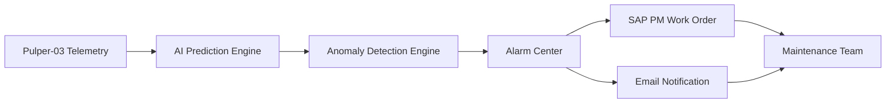

# 🏭 PredictX Industrial AI Platform

**[TR]** Akıllı üretim tesisleri için geliştirilmiş, yapay zeka destekli kestirimci bakım platformu.

**[EN]** AI-powered predictive maintenance platform developed for smart manufacturing environments.

---

# 🇹🇷 Türkçe

## 📌 Proje Özeti

PredictX, gerçek zamanlı makine telemetri verilerini analiz ederek makine öğrenmesi ve anomali tespit algoritmaları yardımıyla arızaları gerçekleşmeden önce tahmin eden yapay zeka destekli bir kestirimci bakım platformudur.

Platform; plansız duruş sürelerini azaltmayı, bakım maliyetlerini optimize etmeyi, ekipman güvenilirliğini artırmayı ve bakım operasyonlarını dijitalleştirmeyi hedeflemektedir.

---

## 🚀 Öne Çıkan Özellikler

### 🤖 Yapay Zeka Destekli Arıza Tahmini

* Makine Sağlık Skoru hesaplama
* Arıza risk tahmini
* Kalan Faydalı Ömür (RUL) öngörüsü
* Yapay zeka destekli bakım önerileri

### 🚨 Akıllı Alarm Merkezi

* Gerçek zamanlı anomali tespiti
* Kural tabanlı ve makine öğrenmesi destekli alarm sistemi
* Çok seviyeli alarm yapısı (Düşük, Orta, Kritik)
* Alarm geçmişi ve olay takibi

### 📧 Bildirim Sistemi

* Otomatik e-posta bildirim simülasyonu
* Alarm önceliğine göre dinamik yönlendirme
* Kritik olaylarda bakım ekiplerinin bilgilendirilmesi

### 🛠 SAP PM İş Emri Simülasyonu

* Kritik alarmlarda otomatik iş emri oluşturma
* Öncelik bazlı bakım ekibi ataması
* ERP bakım süreçlerinin simülasyonu

### 📊 Raporlama ve Analitik

* Geçmiş alarm analizi
* KPI ve bakım performans göstergeleri
* Operasyonel verimlilik takibi

---

## 🛠 Teknoloji Yığını

| Katman           | Kullanılan Teknolojiler                                          |
| ---------------- | ---------------------------------------------------------------- |
| Backend & Arayüz | Python, Streamlit                                                |
| Veritabanı       | PostgreSQL, Supabase, Psycopg2                                   |
| Yapay Zeka       | Scikit-Learn, Predictive Analytics, Rule-Based Anomaly Detection |
| Bulut & DevOps   | GitHub, Streamlit Community Cloud, Supabase                      |

---

## 📐 Mimari ve İş Akışı

### Örnek İş Akışı

1. Üretim ekipmanından (Örn: Pulper-03) telemetri verisi gelir.
2. Yapay zeka modeli makine sağlık skorunu ve risk seviyesini hesaplar.
3. Anomali motoru makine durumunu analiz eder.
4. Eşik değerler aşıldığında akıllı alarm oluşturulur.
5. Teknik ekibe otomatik bildirim gönderilir.
6. SAP PM üzerinde bakım iş emri oluşturulur.
7. Olay zaman çizelgesi güncellenir.

---

## 📦 Demo Bileşenleri

* 🏭 Pulper-03 Digital Twin
* 🤖 AI Prediction Center
* 🚨 Alarm Center
* 📅 Event Timeline
* 🛠 SAP PM Work Orders
* 📊 Reporting Dashboard

---

## 🌐 Canlı Demo

🚀 [https://predictx-industrial-ai-tq2dbhbtukqjr53mzdgnub.streamlit.app/](https://predictx-industrial-ai-tq2dbhbtukqjr53mzdgnub.streamlit.app/)

---

## 📌 Versiyon

**Current Version:** `v1.0 MVP`

---

## 👩‍💻 Geliştirici

**Berragül Çulha**
Endüstri Mühendisliği & Bilgisayar Programcılığı Öğrencisi

Endüstriyel Yapay Zeka, Dijital Dönüşüm ve Kestirimci Bakım alanlarında geliştirilmiştir.

---

# 🇬🇧 English

## 📌 Project Summary

PredictX is an AI-powered predictive maintenance platform that analyzes real-time machine telemetry data and predicts failures before they occur using machine learning and anomaly detection algorithms.

The platform aims to reduce unplanned downtime, optimize maintenance costs, improve equipment reliability, and digitalize maintenance operations.

---

## 🚀 Key Features

### 🤖 AI Failure Prediction

* Machine Health Score calculation
* Failure risk estimation
* Remaining Useful Life (RUL) prediction
* AI-driven maintenance recommendations

### 🚨 Intelligent Alarm Center

* Real-time anomaly detection
* Rule-based and ML-driven alarm system
* Multi-level alarm structure (Low, Medium, Critical)
* Historical alarm tracking

### 📧 Notification System

* Automated email notification simulation
* Dynamic severity-based routing
* Maintenance team escalation workflows

### 🛠 SAP PM Work Order Simulation

* Automatic work order generation
* Priority-based maintenance assignment
* ERP maintenance workflow simulation

### 📊 Reporting & Analytics

* Historical alarm analysis
* Maintenance KPI monitoring
* Operational performance tracking

---

## 🛠 Technology Stack

| Layer          | Technologies                                                     |
| -------------- | ---------------------------------------------------------------- |
| Backend & UI   | Python, Streamlit                                                |
| Database       | PostgreSQL, Supabase, Psycopg2                                   |
| AI & Analytics | Scikit-Learn, Predictive Analytics, Rule-Based Anomaly Detection |
| Cloud & DevOps | GitHub, Streamlit Community Cloud, Supabase                      |

---

## 📐 Architecture & Workflow

### Example Workflow

1. Telemetry data is received from industrial equipment (e.g., Pulper-03).
2. The AI engine calculates machine health and risk scores.
3. The anomaly detection module analyzes operating conditions.
4. Intelligent alarms are triggered when thresholds are exceeded.
5. Automated notifications are sent to maintenance teams.
6. SAP PM work orders are generated automatically.
7. The event timeline is updated in real time.

---

## 📦 Demo Components

* 🏭 Pulper-03 Digital Twin
* 🤖 AI Prediction Center
* 🚨 Alarm Center
* 📅 Event Timeline
* 🛠 SAP PM Work Orders
* 📊 Reporting Dashboard

---

## 🌐 Live Demo

🚀 [https://predictx-industrial-ai-tq2dbhbtukqjr53mzdgnub.streamlit.app/](https://predictx-industrial-ai-tq2dbhbtukqjr53mzdgnub.streamlit.app/)

---

## 📌 Version

**Current Version:** `v1.0 MVP`

---

## 👩‍💻 Author

**Berragül Çulha**
Industrial Engineering & Computer Programming Student

Developed as an Industrial AI, Digital Transformation, and Predictive Maintenance project for Industry 4.0 manufacturing environments.
