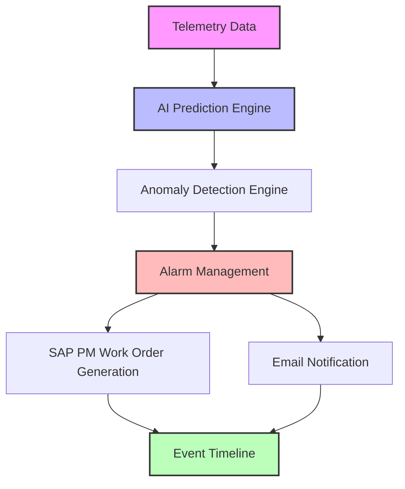

# 🏭 PredictX Industrial AI Platform

[TR] Akıllı kağıt üretim tesisleri için geliştirilmiş, yapay zeka destekli kestirimci bakım platformu.
[EN] AI-powered predictive maintenance platform developed for smart paper manufacturing environments.

---

## 🇹🇷 Türkçe Proje Özeti

PredictX, gerçek zamanlı makine telemetri verilerini analiz eder; makine öğrenmesi ve anomali tespiti algoritmalarını kullanarak arızaları daha gerçekleşmeden önce tahmin eder.

### 🚀 Öne Çıkan Özellikler

#### 🤖 Yapay Zeka Destekli Arıza Tahmini
- **Makine Sağlık Skoru:** Ekipmanın genel sağlık durumunun gerçek zamanlı hesaplanması.
- **Risk Tahmini:** Tahminleme modelleriyle arıza olasılıklarının belirlenmesi.
- **RUL Öngörüsü:** Kritik bileşenler için Kalan Faydalı Ömür (Remaining Useful Life) tahmini.
- **Akıllı Reçeteler:** Bakım ekipleri için yapay zeka destekli aksiyon önerileri.

#### 🚨 Akıllı Alarm Merkezi
- **Gerçek Zamanlı Tespit:** Kural tabanlı ve makine öğrenmesi destekli anomali algılama.
- **Çok Seviyeli Alarmlar:** Kritiklik seviyesine göre ayrıştırılmış alarm sistemi (Düşük, Orta, Kritik).
- **Geçmiş İzleme:** Kritik olayların takibi ve geçmiş alarm analizi.

#### 📧 Bildirim Sistemi
- **Otomatik Uyarılar:** Otomatik e-posta bildirim simülasyonu.
- **Akıllı Yönlendirme:** Alarmın önem derecesine göre dinamik bildirim kuralları.

#### 🛠 SAP PM İş Emri Simülasyonu
- **Otomatik İş Emri:** Kritik alarmlar tetiklendiğinde otomatik bakım emri oluşturma.
- **Önceliklendirme:** Arıza tipine göre akıllı bakım ekibi ataması ve öncelik yönetimi.
- **ERP Entegrasyonu:** Simüle edilmiş SAP PM iş akışı entegrasyonu.

#### 📊 Raporlama ve Analitik
- **Geçmiş Analizi:** Geçmiş anomali ve alarm sıklıklarının derinlemesine analizi.
- **KPI Takibi:** Bakım verimliliğini izleyen operasyonel istatistik paneli.

---

## 🇬🇧 English Project Summary

PredictX analyzes real-time machine telemetry data and predicts failures before they occur using machine learning and anomaly detection algorithms.

### 🚀 Key Features

#### 🤖 AI Failure Prediction
- **Machine Health Score:** Real-time calculation of overall equipment health.
- **Risk Estimation:** Failure probability estimation using predictive models.
- **RUL Prediction:** Remaining Useful Life forecasting for critical components.

#### 🚨 Intelligent Alarm Center
- **Real-Time Detection:** Instant rule-based and ML-driven anomaly detection.
- **Multi-Level Alarms:** Categorized alert system (Low, Medium, Critical).

#### 📧 Notification System
- **Automated Alerts:** Automatic email notification simulation.
- **Smart Routing:** Configurable notification rules based on severity.

#### 🛠 SAP PM Work Order Simulation
- **Auto-Generation:** Automatic maintenance order generation triggered by critical alarms.
- **Priority-Based Routing:** Smart priority assignment and maintenance team distribution.

#### 📊 Reporting & Analytics
- **KPI Monitoring:** Operational statistics dashboard tracking maintenance efficiency.

---

## 🛠 Technology Stack / Teknoloji Yığını

| Layer / Katman | Technologies Used / Kullanılan Teknolojiler |
| :--- | :--- |
| **Backend & UI** | Python, Streamlit |
| **Database** | PostgreSQL (Supabase), Psycopg2 |
| **AI / ML** | Scikit-Learn, Predictive Analytics, Rule-Based Anomaly Detection |
| **DevOps & Cloud**| GitHub, Streamlit Community Cloud, Supabase |

---

## 📐 Architecture & Workflow / Mimari ve İş Akışı

### Örnek İş Akışı (Example Workflow)

1. Üretim ekipmanından (Örn: Pulper-03) telemetri verisi gelir.
2. Yapay zeka modeli risk skorunu hesaplar.
3. Anomali motoru makine durumunu eşik değerlere göre inceler.
4. Eşik aşılırsa akıllı alarm üretilir.
5. Teknik ekibe otomatik e-posta bildirimi tetiklenir.
6. SAP PM üzerinde otomatik olarak bakım iş emri ve ekip ataması oluşturulur.
7. Merkezi olay zaman çizelgesi (Event Timeline) güncellenir.

---

## 📦 Demo Components / Demo Bileşenleri

* **Pulper-03 Digital Twin:** Gerçek zamanlı dijital ikiz ve telemetri paneli.
* **Alarm Center:** Aktif izleme ve alarm yönetim arayüzü.
* **Event Timeline:** Operasyonel olayların kronolojik takibi.
* **SAP PM Work Orders:** Bakım planlama ve iş emri dağıtım merkezi.
* **AI Prediction Center:** Makine öğrenmesi model çıktıları ve parametre analizleri.

---

## 📌 Version / Versiyon

Current Version: `v1.0 MVP`

---

## ✍️ Author / Geliştirici

**Berragül Çulha**

*Industrial Engineering & Computer Programming Student*

*Developed as an Industrial AI and Predictive Maintenance project.*

